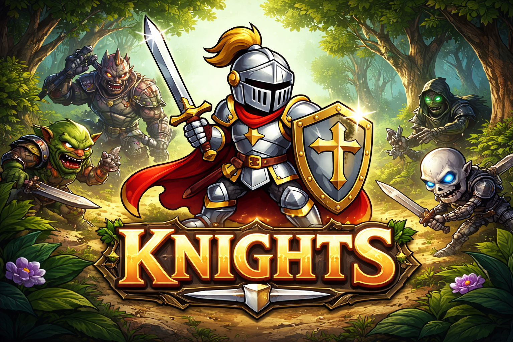

<p align="center">
  
</p>

# ⚔️ Knights
*A tiny turn-based battle game built for mobile and desktop.*

---

## 🎮 Overview
**Knights** is a minimalist turn-based battle game built with Phaser.  
It focuses on a simple combat triangle:

- **Attack** – spend 1 heart to deal 1 heart damage  
- **Defend** – gain 1 heart and reduce incoming damage  
- **Breathe** – recover breath to enable future actions  

The game runs in any modern browser and supports installation as a **Progressive Web App (PWA)**.

---

## ✨ Features
- Mobile-first responsive layout  
- Works offline using a service worker  
- Installable on Android, iOS, Windows  
- Simple heart-based combat mechanic  
- Easy-to-modify code structure  
- No build tools required (runs directly in browser)  

---

## ⚙️ Project Structure
```
index.html
main.js
sw.js
manifest.webmanifest

/css
/scenes
/components
/assets
/icons
```

---

## 🚀 Running the Game (VS Code + Live Server)
1. Install the **Live Server** extension  
2. Open the project folder in VS Code  
3. Click **Go Live** in the bottom bar  
4. The game opens at:  
   ```
   http://127.0.0.1:5500
   ```

---

## 📱 Installing as a PWA

### Android
Chrome → Menu → **Install App**

### iOS (Safari)
Share → **Add to Home Screen**

### Windows (Chrome/Edge)
Menu → **Install this site as an app**

---

## 🧪 Service Worker Notes
- The service worker only works over **localhost** or **https**
- If updates don’t appear:
  - Open DevTools → Application → Service Workers  
  - Click **Unregister**
  - Refresh with **Ctrl + Shift + R**  
- When updating cached files, bump the version in `sw.js`:
  ```js
  const CACHE_NAME = "knights-cache-v2";
  ```

---

## 🛡 Controls
| Action | Effect |
|--------|--------|
| Attack | Spend 1 heart to deal 1 heart |
| Defend | Gain 1 heart |
| Breathe | Recover breath |

---

## 📜 License
This project is open for learning and modification.
